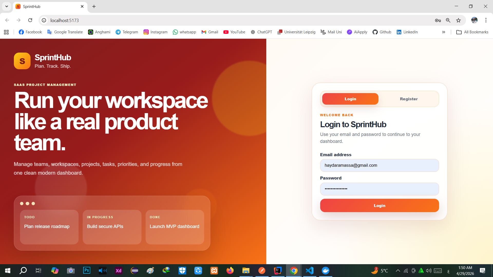
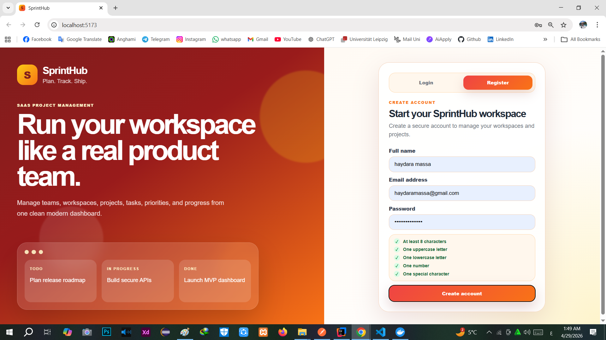
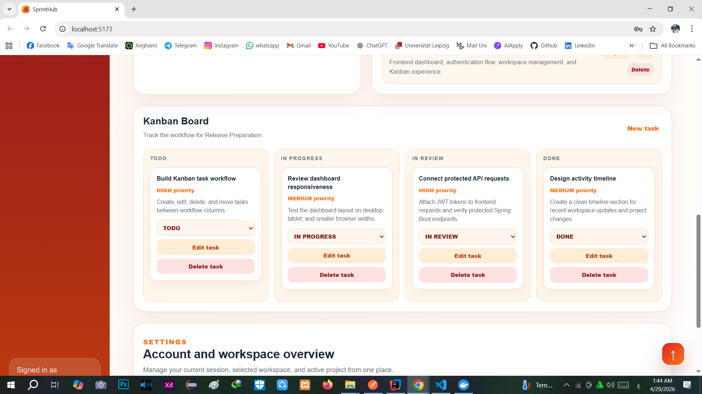
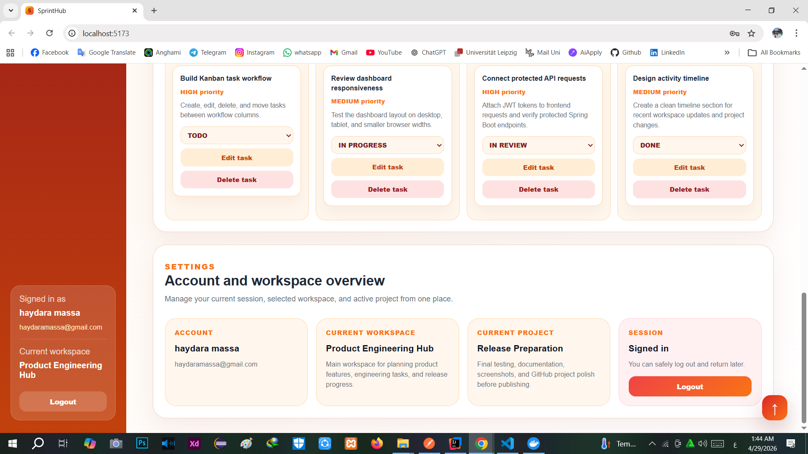

# SprintHub

SprintHub is a full-stack project management web application built with React, Spring Boot, MySQL, Docker, and JWT authentication.  
It allows users to create workspaces, manage projects, organize tasks, and track work through a real Kanban workflow.

## Overview

SprintHub was built as a modern SaaS-style productivity platform.  
The application includes authentication, protected API endpoints, workspace management, project management, task management, status updates, and a clean responsive dashboard UI.

## Features

### Authentication
- User registration
- User login
- Logout
- JWT-based authentication
- Protected backend API endpoints
- Password validation on the frontend

### Workspaces
- Create workspace
- View user workspaces
- Edit workspace
- Delete workspace
- Automatically remove related projects and tasks when a workspace is deleted

### Projects
- Create projects inside a workspace
- View projects by selected workspace
- Edit project
- Delete project
- Automatically remove related tasks when a project is deleted

### Tasks
- Create tasks inside a project
- View tasks by selected project
- Edit task title, description, and priority
- Delete task
- Update task status
- Track tasks using Kanban columns:
  - TODO
  - IN PROGRESS
  - IN REVIEW
  - DONE

### User Interface
- Modern React dashboard
- Login and registration pages
- Workspace and project selectors
- Kanban board
- Toast notifications
- Settings overview
- Responsive layout
- Custom favicon
- Professional red, orange, yellow, and white visual theme

## Tech Stack

### Frontend
- React
- Vite
- JavaScript
- CSS
- Fetch API
- LocalStorage for session handling

### Backend
- Java
- Spring Boot
- Spring Web
- Spring Data JPA
- Spring Security
- JWT
- Bean Validation

### Database and Tools
- MySQL
- Docker
- Docker Compose
- phpMyAdmin
- Postman
- Maven

## Project Structure

```text
sprinthub
├── sprinthub-backend
│   ├── auth
│   ├── user
│   ├── workspace
│   ├── project
│   ├── task
│   ├── security
│   └── config
│
├── sprinthub-frontend
│   ├── src
│   │   ├── components
│   │   │   ├── AuthPage.jsx
│   │   │   ├── Sidebar.jsx
│   │   │   ├── Modals.jsx
│   │   │   └── KanbanBoard.jsx
│   │   ├── api.js
│   │   ├── App.jsx
│   │   └── App.css
│   └── public
│       └── favicon.svg
│
└── README.md


```

## Main API Features

### Authentication

```text
POST /api/auth/register
POST /api/auth/login

```

### Workspaces

```text
GET    /api/workspaces/user/{userId}
POST   /api/workspaces
PUT    /api/workspaces/{workspaceId}
DELETE /api/workspaces/{workspaceId}
```

### Projects

```text
GET    /api/workspaces/{workspaceId}/projects
POST   /api/workspaces/{workspaceId}/projects
PUT    /api/projects/{projectId}
DELETE /api/projects/{projectId}
```

### Tasks

```text
GET    /api/projects/{projectId}/tasks
POST   /api/projects/{projectId}/tasks
PUT    /api/tasks/{taskId}
DELETE /api/tasks/{taskId}
PATCH  /api/tasks/{taskId}/status
```

## Security

SprintHub uses JWT authentication.

After login, the backend returns a token. The frontend stores it locally and sends it with protected API requests using:

```text
Authorization: Bearer <token>
```

Only the authentication routes are public. Workspace, project, and task APIs require a valid JWT token.

## How to Run the Project

### 1. Start MySQL and phpMyAdmin

From the backend project folder, run:

```bash
docker compose up -d
```

phpMyAdmin can be opened at:

```text
http://localhost:8081
```

### 2. Run the Backend

Open the backend project in IntelliJ IDEA and run the Spring Boot application.

Backend URL:

```text
http://localhost:8080
```

### 3. Run the Frontend

Open the frontend project folder and run:

```bash
npm install
npm run dev
```

Frontend URL:

```text
http://localhost:5173
```

## Screenshots

### Authentication

| Login | Register |
|---|---|
|  |  |

### Workspace and Project Management

| Create Workspace | Workspaces and Projects |
|---|---|
|  |  |

| Create Project | Update Project |
|---|---|
|  |  |

### Task Management and Kanban

| Create Task | Kanban Board |
|---|---|
|  |  |

### Settings

| Settings Overview |
|---|
|  |
## Current Status

SprintHub currently includes the full core workflow:

```text
Register → Login → Create Workspace → Create Project → Create Task → Track Task in Kanban
```

The main CRUD features are complete for workspaces, projects, and tasks.

## Future Improvements

- Drag and drop task movement
- Team members and roles
- Task comments
- Due dates
- Search and filters
- Dark mode
- Deployment
- Refresh tokens
- User profile settings

## Author

Built by Haydara Massa
